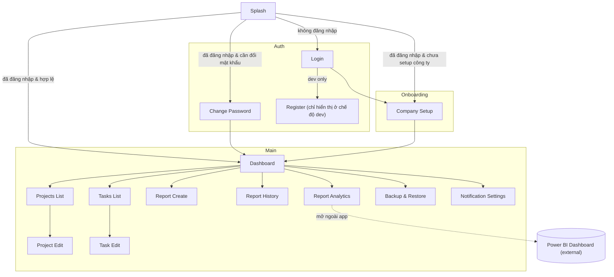

## Sơ đồ ứng dụng (Navigation & Screens)

Sơ đồ được sinh từ cấu hình routes hiện tại trong `lib/app/routes/app_router.dart`.

Ghi chú:
- Màn `Register` chỉ khả dụng khi không phải bản release (`!kReleaseMode`).
- `Report Analytics` có nút mở dashboard Power BI bằng `url_launcher` ở ngoài ứng dụng.
- `Backup & Restore` dùng OneDrive để export/restore dữ liệu.

