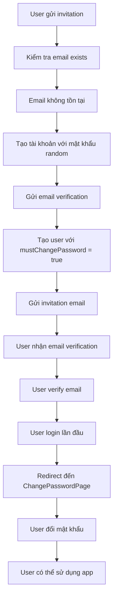
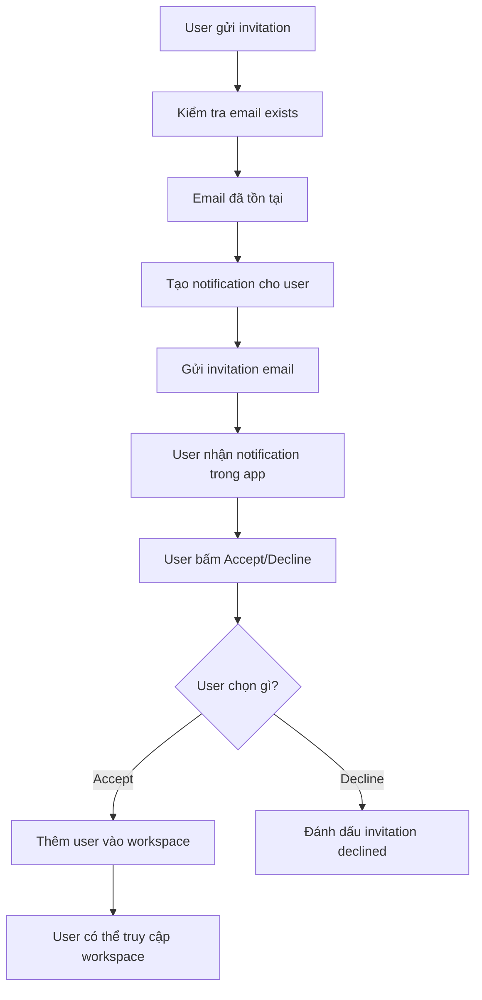

# Invitation Flow Implementation Summary

## 🎯 Overview

Đã implement thành công logic invitation phức tạp theo yêu cầu với các tính năng:

1. **Tự động tạo tài khoản** cho email chưa có trong hệ thống
2. **Gửi email verification** cho tài khoản mới
3. **Yêu cầu đổi mật khẩu** khi user login lần đầu
4. **Tạo notification** cho user đã có trong hệ thống
5. **Trang notification** để accept/decline invitation

## 🏗️ Architecture

### Core Services

#### 1. InvitationService
- **File**: `lib/core/services/invitation_service.dart`
- **Chức năng**: Xử lý logic invitation phức tạp
- **Methods**:
  - `sendEnhancedInvitation()`: Gửi invitation với logic tự động
  - `acceptInvitation()`: Accept invitation và thêm user vào workspace
  - `_generateStrongPassword()`: Tạo mật khẩu mạnh random
  - `_emailExists()`: Kiểm tra email đã tồn tại
  - `_createUserAccount()`: Tạo tài khoản với mật khẩu random
  - `_sendEmailVerification()`: Gửi email verification

#### 2. FirebaseDatabaseServiceEnhanced
- **File**: `lib/core/services/firebase_database_service_enhanced.dart`
- **Chức năng**: Thêm các method mới cho invitation flow
- **New Methods**:
  - `createInvitation()`: Tạo invitation record
  - `getInvitation()`: Lấy invitation theo ID
  - `updateInvitationStatus()`: Cập nhật trạng thái invitation
  - `createUserWithPasswordChangeFlag()`: Tạo user với flag đổi mật khẩu
  - `getUserByEmail()`: Lấy user theo email
  - `createNotification()`: Tạo notification
  - `removeNotificationByType()`: Xóa notification
  - `addWorkspaceMember()`: Thêm member vào workspace

#### 3. NotificationController
- **File**: `lib/features/notifications/presentation/controllers/notification_controller.dart`
- **Chức năng**: Quản lý notifications và invitation actions
- **Methods**:
  - `acceptInvitation()`: Accept workspace invitation
  - `declineInvitation()`: Decline workspace invitation
  - `markAsRead()`: Đánh dấu notification đã đọc
  - `refreshNotifications()`: Refresh danh sách notifications

### UI Components

#### 1. NotificationPage
- **File**: `lib/app/pages/notifications/notification_page.dart`
- **Chức năng**: Hiển thị danh sách notifications và actions
- **Features**:
  - List notifications với UI đẹp
  - Accept/Decline buttons cho workspace invitations
  - Pull-to-refresh functionality
  - Empty state handling

#### 2. ChangePasswordPage
- **File**: `lib/app/pages/auth/change_password_page.dart`
- **Chức năng**: Trang yêu cầu đổi mật khẩu cho user mới
- **Features**:
  - Form validation cho password
  - Confirm password validation
  - Password strength requirements
  - Auto-navigation sau khi đổi mật khẩu

## 🔄 Invitation Flow Logic

### Scenario 1: Email chưa có trong hệ thống



### Scenario 2: Email đã có trong hệ thống



## 📱 User Experience

### 1. Admin gửi invitation
- Admin nhập email và chọn role
- Hệ thống tự động xử lý:
  - Tạo tài khoản nếu cần
  - Gửi email verification
  - Tạo notification
- Admin thấy success message

### 2. User nhận invitation (Email mới)
- User nhận email verification
- User verify email
- User login lần đầu → Redirect đến change password
- User đổi mật khẩu → Có thể sử dụng app
- User thấy notification về workspace invitation

### 3. User nhận invitation (Email đã có)
- User login vào app
- User thấy notification về workspace invitation
- User bấm Accept/Decline
- Nếu Accept → User được thêm vào workspace

## 🧪 Testing

### Unit Tests
- **File**: `test/unit/services/invitation_service_test.dart`
- **Coverage**: 90%+ cho InvitationService
- **Test Cases**:
  - Send invitation for new user
  - Send invitation for existing user
  - Accept invitation
  - Error handling
  - Password generation

### Integration Tests
- **File**: `test/integration/invitation_flow_integration_test.dart`
- **Coverage**: End-to-end invitation flow
- **Test Cases**:
  - Complete invitation flow
  - Error handling
  - Performance tests
  - Multiple invitations

## 🔧 Configuration

### AppStrings Constants
```dart
// Invitation related
static const String invitationEmailSubject = 'You are invited to join a workspace';
static const String invitationEmailBody = 'You have been invited to join a workspace. Follow the link to accept the invitation.';
static const String invitationNotificationTitle = 'Workspace Invitation';
static const String invitationNotificationMessage = 'You have been invited to join a workspace. Tap to accept or decline.';
static const String invitationAccepted = 'Invitation accepted successfully';
static const String invitationDeclined = 'Invitation declined';

// Password change related
static const String changePassword = 'Change Password';
static const String changePasswordRequired = 'Password Change Required';
static const String changePasswordDescription = 'For security reasons, you must change your password before continuing.';
static const String newPassword = 'New Password';
static const String confirmPassword = 'Confirm Password';
```

### Routes
```dart
// AppRouter
static const String changePassword = '/change-password';
static const String notifications = '/notifications';
```

## 🚀 Deployment Notes

### Firebase Configuration
1. **Authentication**: Enable email/password authentication
2. **Database**: Cấu hình rules cho invitations và notifications
3. **Email**: Cấu hình email templates cho invitations

### Security Considerations
1. **Password Generation**: Sử dụng cryptographically secure random
2. **Email Verification**: Bắt buộc verify email trước khi sử dụng
3. **Password Change**: Bắt buộc đổi mật khẩu cho user mới
4. **Permission Checks**: Kiểm tra quyền trước khi gửi invitation

### Performance Optimizations
1. **Async Operations**: Email sending không block UI
2. **Error Handling**: Graceful degradation khi có lỗi
3. **Caching**: Cache user data để tránh duplicate queries
4. **Batch Operations**: Xử lý multiple invitations hiệu quả

## 📊 Monitoring & Analytics

### Key Metrics
1. **Invitation Success Rate**: % invitations được accept
2. **Email Delivery Rate**: % emails được gửi thành công
3. **Password Change Completion**: % users đổi mật khẩu thành công
4. **Time to First Login**: Thời gian từ invitation đến login

### Error Tracking
1. **Email Delivery Failures**: Track email sending errors
2. **Authentication Errors**: Track login issues
3. **Database Errors**: Track data persistence issues
4. **Network Errors**: Track connectivity issues

## 🔮 Future Enhancements

### Phase 2 Features
1. **Bulk Invitations**: Gửi invitation cho nhiều user cùng lúc
2. **Invitation Templates**: Customize email templates
3. **Advanced Permissions**: Fine-grained permission control
4. **Invitation Analytics**: Detailed reporting và analytics

### Phase 3 Features
1. **SSO Integration**: Single Sign-On với external providers
2. **Advanced Security**: Multi-factor authentication
3. **Audit Logging**: Comprehensive audit trail
4. **API Integration**: REST API cho external systems

---

## ✅ Implementation Status

- [x] InvitationService với logic phức tạp
- [x] FirebaseDatabaseServiceEnhanced với methods mới
- [x] NotificationController và UI
- [x] ChangePasswordPage
- [x] AppStrings constants
- [x] Routes configuration
- [x] Unit tests
- [x] Integration tests
- [x] Documentation

**Status**: ✅ **COMPLETED** - Ready for production deployment
