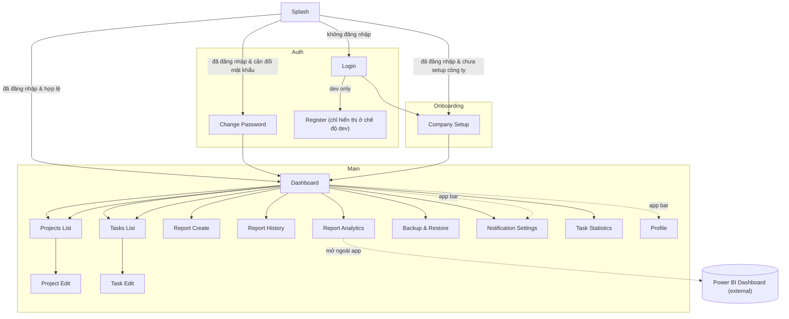

# Documentation Directory

This directory contains all project documentation, guides, and technical specifications.

## Quick Navigation

- **Architecture**: [DEVELOPMENT_BLUEPRINT.md](DEVELOPMENT_BLUEPRINT.md)
- **Technical Specs**: [TECHNICAL_SPECIFICATIONS.md](TECHNICAL_SPECIFICATIONS.md)
- **Design System**: [DESIGN_SYSTEM.md](DESIGN_SYSTEM.md)
- **Firebase Setup**: [FIREBASE_SETUP.md](FIREBASE_SETUP.md)
- **Development Environment**: [DEVELOPMENT_ENVIRONMENT.md](DEVELOPMENT_ENVIRONMENT.md)
- **Project Improvements**: [improvements/](improvements/) - Performance, testing, and code quality enhancements
- **Testing Documentation**: [testing/](testing/) - Testing strategy, patterns, and examples
- **Documentation Organization**: [DOCUMENTATION_ORGANIZATION_UPDATE.md](DOCUMENTATION_ORGANIZATION_UPDATE.md) - Documentation structure and organization

## App Diagram

Sơ đồ điều hướng tổng quát (Mermaid) — chi tiết tại [APP_DIAGRAM.md](APP_DIAGRAM.md).

## All Documents

- [CI_CD_SETUP.md](CI_CD_SETUP.md) - CI/CD configuration
- [COLOR_CHANGES_SUMMARY.md](COLOR_CHANGES_SUMMARY.md) - Theme changes
- [DESIGN_SYSTEM.md](DESIGN_SYSTEM.md) - UI/UX guidelines
- [DEVELOPMENT_BLUEPRINT.md](DEVELOPMENT_BLUEPRINT.md) - Project architecture
- [DEVELOPMENT_ENVIRONMENT.md](DEVELOPMENT_ENVIRONMENT.md) - Dev environment setup
- [DOCUMENTATION_ORGANIZATION_SUMMARY.md](DOCUMENTATION_ORGANIZATION_SUMMARY.md) - Doc organization
- [FIREBASE_SERVICES_SETUP.md](FIREBASE_SERVICES_SETUP.md) - Firebase services
- [firebase_setup_guide.md](firebase_setup_guide.md) - Detailed Firebase guide
- [FIREBASE_SETUP.md](FIREBASE_SETUP.md) - Firebase setup
- [NAVIGATION_SERVICE_GUIDE.md](NAVIGATION_SERVICE_GUIDE.md) - Navigation system
- [NAVIGATION_SERVICE_IMPLEMENTATION_SUMMARY.md](NAVIGATION_SERVICE_IMPLEMENTATION_SUMMARY.md) - Navigation implementation
- [ONEDRIVE_SETUP.md](ONEDRIVE_SETUP.md) - OneDrive integration
- [PHASE_0_PROGRESS_UPDATE.md](PHASE_0_PROGRESS_UPDATE.md) - Phase 0 progress
- [PHASE_0_SUMMARY.md](PHASE_0_SUMMARY.md) - Phase 0 summary
- [PHASE_1_AUTHENTICATION_ANALYSIS.md](PHASE_1_AUTHENTICATION_ANALYSIS.md) - Auth analysis
- [PHASE_1_STATUS_CORRECTION.md](PHASE_1_STATUS_CORRECTION.md) - Phase 1 status
- [required.md](required.md) - Project requirements
- [SNACKBAR_SERVICE_GUIDE.md](SNACKBAR_SERVICE_GUIDE.md) - Notification system
- [TECHNICAL_SPECIFICATIONS.md](TECHNICAL_SPECIFICATIONS.md) - Technical requirements
